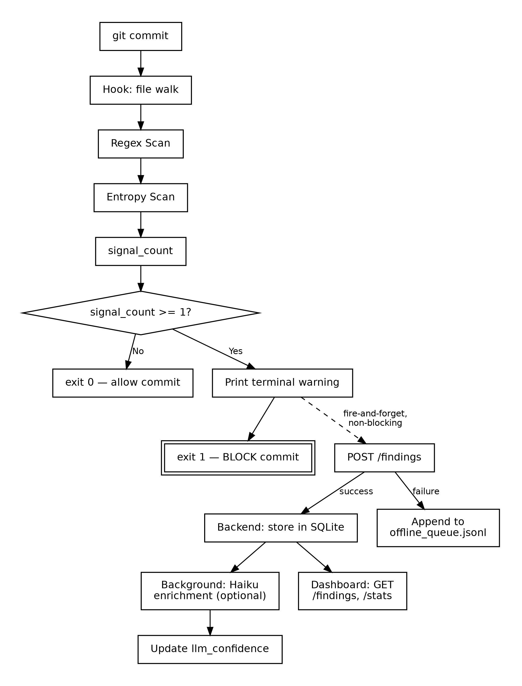
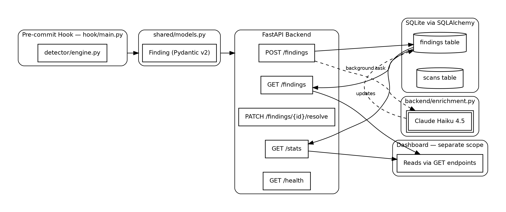
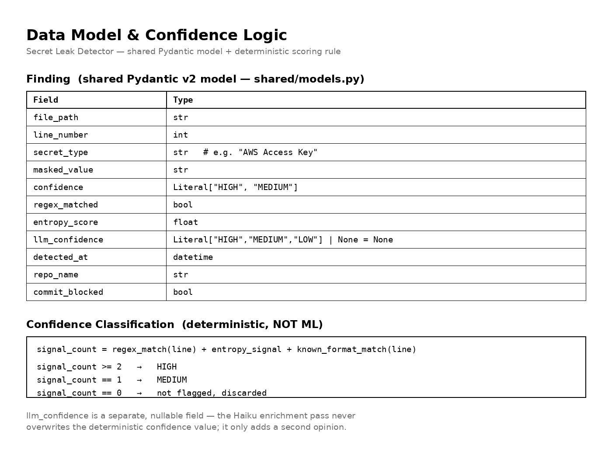
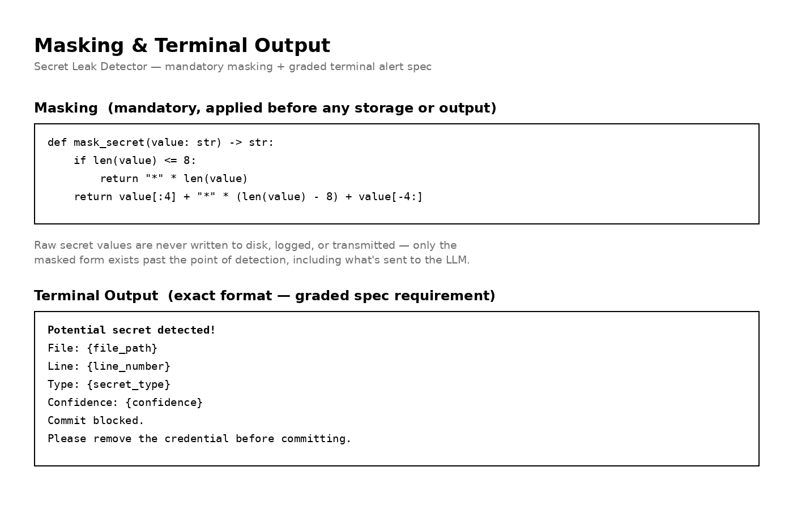
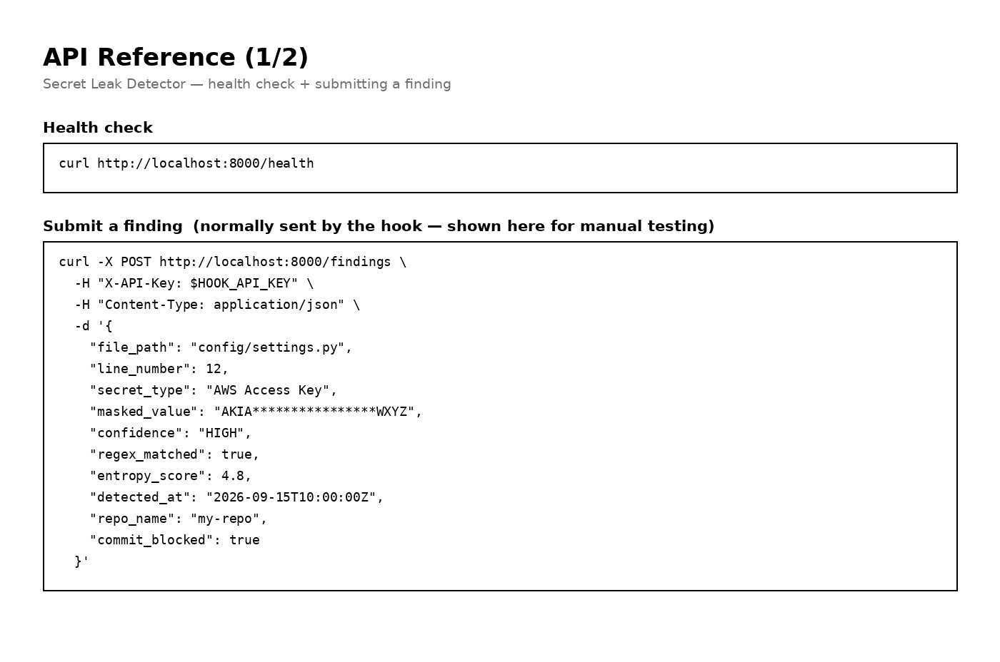
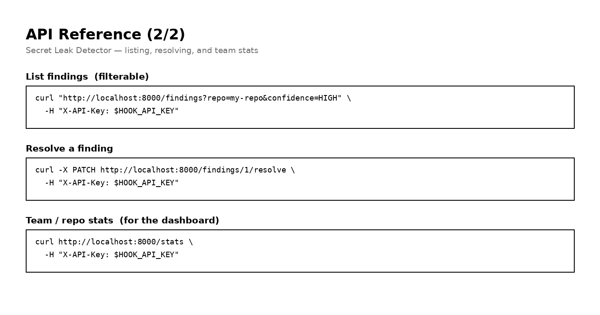

# 🔐 Secret Leak Detector

> Catch leaked API keys and credentials before they ever leave your laptop — a deterministic regex + entropy engine with an optional AI enrichment pass, not a black box.

[](#license)

[](#-deployment)
[](#-deployment)

---

## 📑 Table of Contents

1. [Problem Statement](#-problem-statement)
2. [The Solution](#-the-solution)
3. [Key Features](#-key-features)
4. [Why This Is Different](#-why-this-is-different)
5. [System Architecture](#-system-architecture)
6. [Tech Stack](#-tech-stack)
7. [Data Model & Confidence Logic](#-data-model--confidence-logic)
8. [Getting Started (Local Install)](#-getting-started-local-install)
9. [API Reference](#-api-reference)
10. [Deployment](#-deployment)
11. [Feasibility & Viability](#-feasibility--viability)
12. [Known Limitations (Explicit Non-Goals)](#-known-limitations-explicit-non-goals)
13. [Roadmap](#-roadmap)
14. [Research & References](#-research--references)
15. [Team](#-team)
16. [License](#-license)

---

## 🎯 Problem Statement

**Original PS:** Developers accidentally leak sensitive API keys, database credentials, and secret tokens into public source code repositories every day, leading to immediate security compromises. This project builds a pre-commit hook utility and backend that checks codebases for exposed secrets using regex pattern matching and entropy analysis — flagging unsecured credentials, alerting developers immediately, and tracking compliance metrics across a team.

**Sharpened restatement:** The real root cause isn't a missing tool — it's a *broken trust* problem. Existing free scanners either miss real secrets (low recall) or cry wolf so often on harmless strings (low precision) that developers disable or ignore them entirely. This project fixes the trust gap, not just the detection gap.

---

## 💡 The Solution

A **deterministic, rule-based** detection engine (regex + Shannon entropy → a signal-count confidence table) runs entirely locally and synchronously inside the pre-commit hook — no network call ever blocks a commit decision. Findings are then posted, fire-and-forget, to a backend that optionally enriches ambiguous findings with a Claude Haiku classification pass (real credential vs. placeholder/test value) — asynchronously, best-effort, and never able to affect the commit-blocking behavior that already happened locally.

---

## ✨ Key Features

| Feature | What it does |
|---|---|
| 🔍 **Local, synchronous detection** | Regex + entropy scan runs entirely on the developer's machine — zero network dependency to block a bad commit |
| 🧮 **Deterministic confidence classification** | HIGH/MEDIUM confidence from an explicit signal-count rule table — explainable, not a black box |
| 🛰️ **Fire-and-forget backend sync** | Hook never waits on or retries the backend; if it's offline, findings queue locally (`.secretscan/offline_queue.jsonl`) instead of being lost |
| 🧠 **Optional Haiku enrichment** | Async, best-effort second opinion on ambiguous findings — fails silently, never blocks anything |
| 🎭 **Mandatory masking** | Raw secret values are never written to disk, logged, or transmitted — only the masked form exists past the point of detection |
| 📊 **Compliance API** | `/findings`, `/stats`, and resolve endpoints for a dashboard to consume |

---

## 🥊 Why This Is Different

| Tool | Strength | Documented Gap |
|---|---|---|
| Gitleaks | Fast, 150+ patterns, free | High recall (~88%), but only ~46% precision — floods users with false alarms |
| TruffleHog | Verifies credentials are live via API | Verification requires network calls; not instant at commit time |
| GitGuardian | ML filtering claims to cut false positives to 1–3% | Enterprise-only pricing — inaccessible for student/campus/SME teams |
| **This project** | Deterministic explainable rules + optional AI second opinion | Free-tier accessible, and every confidence score is traceable to an explicit rule, not a model's black-box output |

No existing free tool achieves both high precision and high recall simultaneously — this is a documented, benchmarked finding, not a marketing claim (see [Research & References](#-research--references)).

---

## 🏗️ System Architecture

### A. State Machine (what happens on every `git commit`)



### B. Component Architecture



> **Note on the dashboard:** per the backend spec, the dashboard is out of this component's scope — it's expected to consume the `GET /findings` and `GET /stats` endpoints above. If your existing frontend prototype currently reads from LocalStorage, the next integration step is pointing it at these real endpoints instead.

---

## 🛠️ Tech Stack

| Layer | Choice | Notes |
|---|---|---|
| Backend framework | FastAPI (Python 3.11+) | |
| ORM / DB | SQLAlchemy (sync) + SQLite | Sync chosen deliberately — simplicity over performance at this scale |
| Shared models | Pydantic v2 (`shared/models.py`) | Single source of truth, imported by both hook and backend — never duplicated |
| Pre-commit hook | Python, installed via the `pre-commit` framework | `.pre-commit-hooks.yaml` manifest included |
| Enrichment (optional) | Anthropic API — model `claude-haiku-4-5-20251001` | Async, best-effort, fails silently |
| Auth | Single shared secret via `X-API-Key` header | Sufficient for hackathon scope — not a full auth system |
| Dashboard | Out of this component's scope | Consumes the GET endpoints above |

---

## 🗃️ Data Model & Confidence Logic





---

## 🚀 Getting Started (Local Install)

### Prerequisites
- Python 3.11+
- pip
- git
- (optional) an Anthropic API key, for Haiku enrichment

### 1. Backend

```bash
git clone https://github.com/<your-org>/secret-leak-detector.git
cd secret-leak-detector
pip install -r requirements.txt

export HOOK_API_KEY="choose-a-shared-secret"
export ANTHROPIC_API_KEY="sk-ant-..."   # optional — enables Haiku enrichment

uvicorn backend.main:app --reload
# API live at http://localhost:8000
```

### 2. Pre-commit hook (installed per repo you want protected)

```bash
pip install pre-commit
# .pre-commit-hooks.yaml is already included in this repo
pre-commit install
```

Every `git commit` in that repo now runs the hook automatically — no further setup needed.

---

## 📡 API Reference





---

## ☁️ Deployment

⚠️ **Change from the earlier plan:** the original plan deployed everything to Vercel. That works for a static frontend, but **not for this backend** — Vercel's serverless functions have an ephemeral filesystem, so SQLite data would not persist between requests.

**Recommended split:**

| Component | Host | Why |
|---|---|---|
| Backend (FastAPI + SQLite) | **Render** or **Railway** | Persistent disk, long-running process, free tier covers a hackathon demo |
| Dashboard (frontend) | **Vercel** | Static/SPA hosting, points at the backend's public URL for its GET endpoints |

**Render quick steps:**
1. Push this repo to GitHub
2. New Web Service on Render → connect the repo
3. Build command: `pip install -r requirements.txt`
4. Start command: `uvicorn backend.main:app --host 0.0.0.0 --port 10000`
5. Add `HOOK_API_KEY` and `ANTHROPIC_API_KEY` as environment variables in Render's dashboard

---

## 📈 Feasibility & Viability

**Technical feasibility:** ✅ High, and further de-risked by the deterministic design — the core HIGH/MEDIUM classification is an explicit rule table, not a model that needs training or tuning under time pressure. The optional Haiku layer is architected to fail gracefully, so the whole system degrades to "regex+entropy only" rather than breaking if the AI call is unavailable.

**Market viability:** GitGuardian's 2025 monitoring found over 12.8 million hardcoded secrets in public GitHub repos — a 28% year-over-year increase — while their own enterprise pricing already proves willingness to pay for this category. The specific gap this project targets (affordable, explainable, low-false-positive detection) is unserved at the free/campus/SME tier.

**Research grounding:** the hybrid regex+LLM approach mirrors published 2025–2026 research on secret classification (see below), which independently converged on the same architecture this project uses.

---

## ⚠️ Known Limitations (Explicit Non-Goals)

These are intentionally out of scope for this component, not oversights:

- **No git history scanning** — working tree only
- **No frontend code** in this component — the dashboard is a separate scope
- **No ML classifier beyond the Haiku enrichment call** — the core confidence logic is deterministic rules
- **No multi-user auth/RBAC** — a single shared `X-API-Key` only
- **No Postgres migration** — SQLite only for this scope

---

## 🗺️ Roadmap

- [ ] Point the dashboard's data layer at the real `GET /findings` and `GET /stats` endpoints (currently the most important integration step)
- [ ] Git-history scanning (Gate 2, catches secrets that predate the hook)
- [ ] Multi-user auth + real-time shared team dashboard
- [ ] Postgres migration for scale beyond hackathon demo
- [ ] VSCode extension for inline real-time warnings
- [ ] Auto-rotation integration with cloud provider APIs

---

## 📚 Research & References

- Basak, S. K., Cox, J., Reaves, B., & Williams, L. (2023). *A Comparative Study of Software Secrets Reporting by Secret Detection Tools*. ESEM 2023 — benchmarked precision/recall across nine tools, source of the "no tool has both high precision and high recall" finding
- GitGuardian, *State of Secrets Sprawl* (2025) — 12.8M+ secrets found in public GitHub repos, 28% YoY increase
- *Secret Breach Detection in Source Code with Large Language Models* (2025) — hybrid regex + LLM classification approach validating this project's core architecture
- *IssueGuard: Real-Time Secret Leak Prevention Tool for GitHub Issue Reports* (2026) — CodeBERT-based classification, 92.70% F1-score reducing false positives

---

## 👥 Team

_Add your team name, member names, and roles here._

---

## 📄 License

This project is licensed under the [MIT License](https://opensource.org/licenses/MIT).
